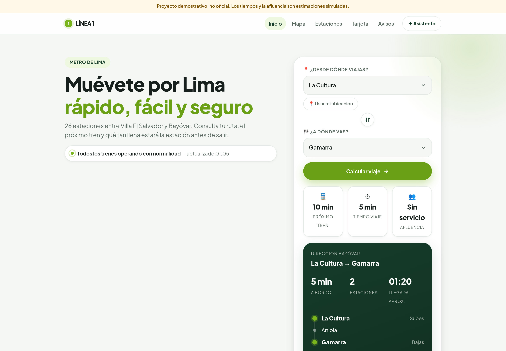
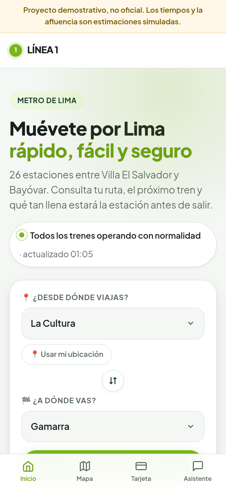

# Línea 1 — Metro de Lima

Concepto de **web-app de movilidad** para la Línea 1 del Metro de Lima: en vez de
una página institucional, una herramienta para gestionar el viaje — planificador,
mapa interactivo de las 26 estaciones, próximos trenes, afluencia por hora,
avisos de servicio y un asistente que responde en lenguaje natural.

> ⚠️ **Proyecto independiente y demostrativo.** No tiene relación con el operador
> oficial de la Línea 1. Los tiempos, frecuencias y niveles de afluencia son
> **estimaciones simuladas** y no deben usarse para tomar un tren.
> Ver [`docs/DATOS.md`](docs/DATOS.md).



<p align="center">
  
</p>

---

## Qué incluye

| Pantalla | Archivo | Contenido |
|---|---|---|
| Inicio | `index.html` | Hero, estado del servicio, planificador, mapa, próximos trenes, afluencia, tarjeta, avisos, asistente |
| Mapa | `mapa.html` | Esquema de la línea + mapa geográfico (Leaflet) + listado por distrito |
| Estación | `estacion.html?id=gamarra` | Ficha por estación: trenes, afluencia, salidas, vecinas, horario |

**Funcionalidades**

- 🗺️ **Mapa interactivo** — las 26 estaciones como elementos clicables, con tarjeta
  flotante de próximos trenes, afluencia y accesibilidad.
- 🧭 **Planificador de viaje** — origen/destino, itinerario animado estación por
  estación, tiempo a bordo, hora de llegada y salida recomendada al bajar.
- 🚆 **Próximos trenes** en ambos sentidos, con frecuencia según la franja horaria.
- 👥 **Afluencia por hora** con recomendación de la mejor franja para viajar.
- 🟢 **Estado del servicio** siempre visible (normal / demoras / interrumpido).
- ✦ **Asistente** que entiende preguntas como *"quiero llegar a Gamarra antes de
  las 9:30 desde San Borja Sur"*. Funciona en el navegador, sin API ni clave.
- 📍 **Usar mi ubicación** para detectar la estación más cercana.
- 📱 **PWA** — instalable desde el navegador, con barra de navegación inferior y
  funcionamiento sin conexión gracias al service worker.

## Cómo ejecutarlo

No hay build ni dependencias. Basta con servir la carpeta:

```bash
git clone https://github.com/shakdows/linea-1-metro-de-lima.git
cd linea-1-metro-de-lima
python3 -m http.server 8000     # o: npx serve .
```

Abre <http://localhost:8000>.

> Abrir `index.html` con doble clic también funciona, pero el service worker
> y la geolocalización requieren `http://` o `https://`.

## Despliegue

**GitHub Pages** — ya viene configurado. En *Settings → Pages* elige
`GitHub Actions` y cada push a la rama principal publica el sitio
(`.github/workflows/pages.yml`).

**Vercel** — importa el repositorio, framework *Other*, sin comando de build y
con `.` como directorio de salida.

## Estructura

```
index.html              Portada
mapa.html               Mapa esquemático + geográfico
estacion.html           Ficha de estación (?id=…)
manifest.webmanifest    Configuración PWA
sw.js                   Service worker (cache-first)
assets/
  css/style.css         Sistema de diseño completo
  js/data.js            Las 26 estaciones y utilidades de dominio
  js/ui.js              Componentes de interfaz reutilizables
  js/planner.js         Cálculo y animación del viaje
  js/assistant.js       Asistente por reglas
  js/app.js             Arranque de la portada
  js/estacion.js        Arranque de la ficha de estación
  js/mapa.js            Arranque del mapa
  img/                  Iconos y portada (marcadores de posición)
tools/generar_iconos.py Genera los PNG de la PWA sin dependencias
docs/                   Datos, arquitectura y guía de diseño
```

## Documentación

- [`docs/DATOS.md`](docs/DATOS.md) — qué es real, qué es estimado y cómo conectar datos oficiales.
- [`docs/ARQUITECTURA.md`](docs/ARQUITECTURA.md) — cómo está hecho y cómo migrar a Next.js + Supabase.
- [`docs/ACTIVOS-Y-DISENO.md`](docs/ACTIVOS-Y-DISENO.md) — **inventario de imágenes y vídeos, con los prompts listos para generarlos**.

## Licencia

MIT — ver [`LICENSE`](LICENSE).
